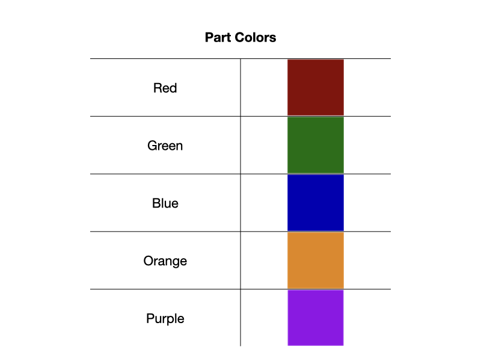

# Challenges-with-Object-Handling-in-Industrial-Environments

### Objects of interest:‬

This project employs parts from the ARIAC industrial environment, which consists of four different types of parts,  in five colors each. 

  
  

## Synthetic Dataset Generation with Blender

The initial step involves installing the ARIAC 2024 package. For installing ARIAC please visit [ARIAC Installation](https://pages.nist.gov/ARIAC_docs/en/latest/getting_started/installation.html#) page.
Note: ARIAC 2024 is built for ROS2 Iron running on Ubuntu 22.04 (Jammy Jellyfish).

Once the package is installed, the required .stl files can be found within the /ariac/ariac_gazebo/models folder. Next, launch Blender to initiate the import process for each .stl object. In the final step of setting up the Blender scene for scripting, attention turns to configuring the camera. 

  

## YOLOv8 - Object Detection Model 

YOLOv8 is a state-of-the-art deep learning model designed for real-time object detection. It achieves a balance between accuracy and speed, making it suitable for various computer vision tasks.

### Results Obtained - Without Occlusions‬

#### Training Dataset
‭The following image shows the number of instances each class has appeared in the training dataset, followed by the average occurrence and (height, width) of their bounding boxes.

  

#### F1 Confidence Curve

F1 Confidence Curve is a visualization tool used to understand the performance of a YOLOv8 model, particularly in object detection. It helps analyze the trade-off between two crucial metrics: precision and recall, across different confidence thresholds.

  

- F1 Score: This metric combines precision (percentage of correctly identified objects) and recall (percentage of all actual objects identified) into a single score.
- Confidence Threshold: YOLOv8 assigns a confidence score to each detection it makes. This score represents the model's certainty about the detection being a true object. The F1 Confidence Curve analyzes the F1 score at various confidence thresholds.
- Trade-off between Precision and Recall: As you increase the confidence threshold, you ensure a higher percentage of detections are true positives (precision goes up), but you might miss some actual objects (recall goes down). The curve depicts this interplay.

#### Confusion Matrix 
Confusion Matrix is a table that visually summarizes the performance of a model on a dataset. It shows how many times the model correctly classified objects (true positives, true negatives) and how often it made mistakes (false positives, false negatives).

  

#### Loss Curves 
A loss curve is a graph that tracks the model's error (or loss) as it learns from training data. The goal is for the loss value to decrease over time, indicating the model is making fewer errors in its predictions.

  

  
  

### Results Obtained - With Occlusions‬

#### F1 Confidence Curve

  

#### Confusion Matrix 

  

#### Loss Curves 

  

  
  

### Prediction example 

  

